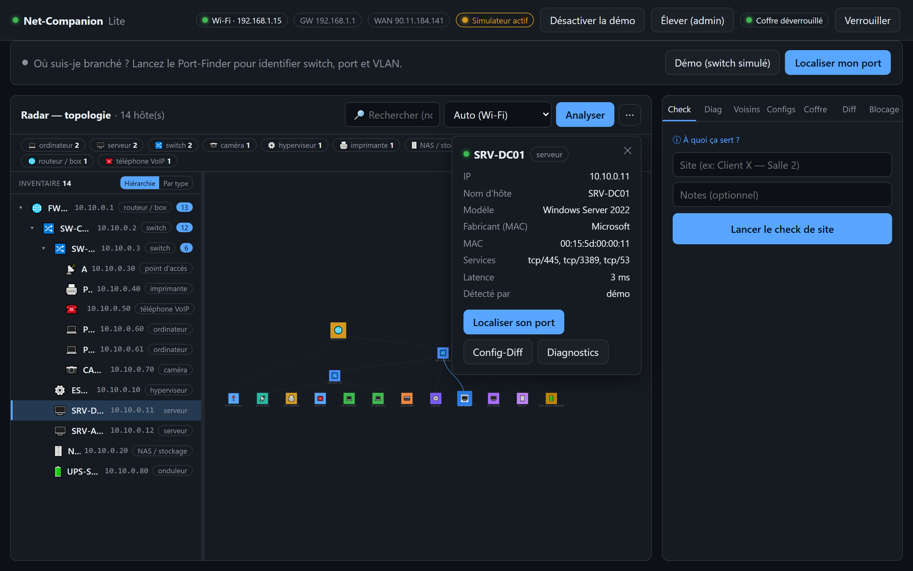
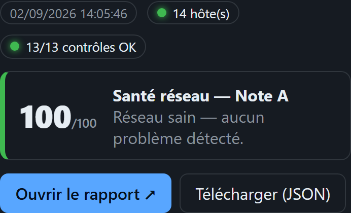
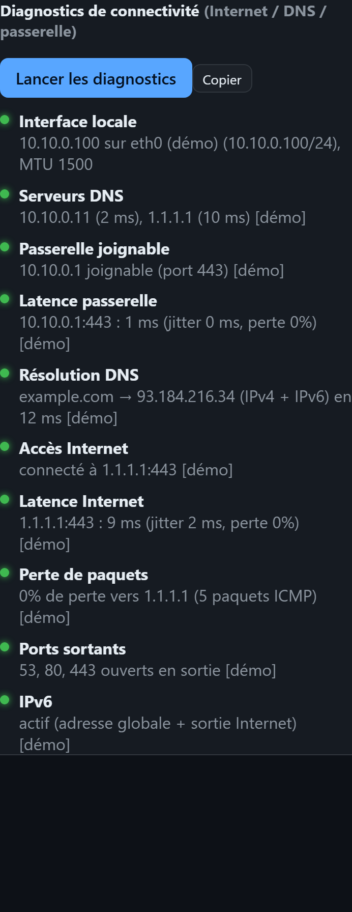
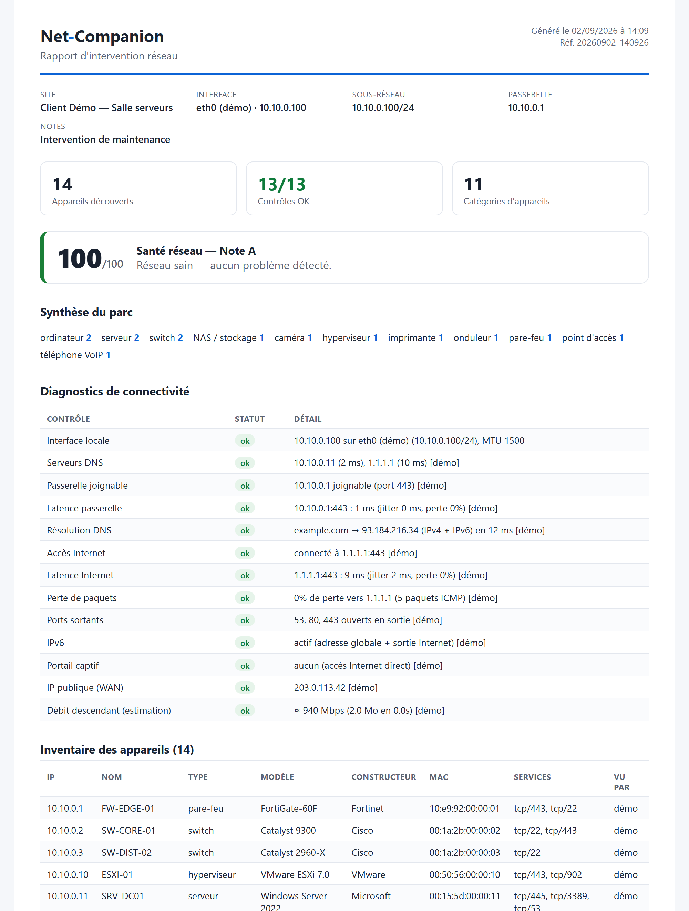

# Net-Companion **Lite**

**Le diagnostic réseau de terrain, sur une clé USB — zéro installation, zéro droits admin.**

Net-Companion Lite est un **binaire unique et portable**. Copié sur une clé USB et
lancé sur n'importe quel poste (Windows / Linux), il ouvre son interface dans le
navigateur et, **en quelques secondes**, dresse **l'inventaire** du réseau,
**l'identifie**, le **diagnostique**, en calcule un **score de santé** et produit
un **rapport prêt à joindre à un ticket** — sans rien installer, sans droits
administrateur, et **sans qu'aucune donnée ne quitte le poste**.

*Auteur : **Charlys Menuet** (Karonath).*



> *Radar & inventaire : découverte, identification typée (pare-feu, switch, serveur,
> imprimante, NAS…), topologie hiérarchique et fiche d'appareil — ici en mode démo.*



> *Check de site en 1 clic : verdict de santé `/100`, contrôles et anomalies, rapport exportable.*

---

## En un coup d'œil (ce que fait la version Lite)

- 🛰️ **Radar & inventaire** — découvre tous les appareils du réseau (balayage ARP
  actif, sans admin) et les **identifie précisément** : nom, modèle, constructeur,
  **type** (pare-feu, switch, serveur, imprimante, NAS, VoIP, caméra, PC…) via
  mDNS / SSDP / NetBIOS / bannières TCP / SNMP. Vue **inventaire arborescent**
  *et* **carte topologique** côte à côte, synchronisées, avec icônes et export
  **PNG / CSV**.
- 🩺 **Diagnostic de connectivité complet (13 points)** — de la carte réseau
  jusqu'à Internet : interface & MTU, serveurs DNS, passerelle + latence,
  résolution DNS, accès + latence Internet, **perte de paquets**, **ports
  sortants** (filtrage), **IPv6**, **portail captif**, **IP publique**, **débit**.
  Plus un **diagnostic ciblé par appareil** (joignabilité, latence, ports ouverts).
- 💚 **Score de santé + détection d'anomalies** — un verdict `/100` (note A→E) et
  la liste de ce qui cloche : conflits/MAC dupliquées, adresses APIPA (pas de
  DHCP), échecs de connectivité, appareils non identifiés.
- 🔌 **Port-Finder** — *« sur quel switch / port / VLAN suis-je branché ? »* en
  langage clair (SNMP). Fini la chasse au port dans l'armoire.
- 🗺️ **Voisinage LLDP/CDP** — les liens **switch-à-switch** réels (SNMP).
- 🧬 **Config-Diff & dérive** — repère les modifications de configuration **non
  sauvegardées** (running vs startup) et la **dérive** vis-à-vis d'une baseline (SSH).
- 🔐 **Coffre-fort d'identifiants** — SNMP/SSH chiffrés (AES-256-GCM), protégés
  par un code PIN, réutilisés automatiquement.
- 🧪 **Mode démo** — un **réseau d'entreprise simulé** complet : toutes les
  fonctions se testent **sans aucun matériel** (formation, démonstration, éval).
- 📄 **Check de site (1 clic) + rapport pro** — état des lieux horodaté,
  historisé, exportable (HTML imprimable / JSON) à joindre au ticket ou remettre
  au client.

### Aperçu — diagnostic & rapport

<p align="center">
  
  &nbsp;&nbsp;
  
</p>

> *À gauche : le **diagnostic 13 points** (du poste au WAN). À droite : le
> **rapport d'intervention** exportable (HTML imprimable / JSON) — synthèse, score
> de santé, diagnostics et inventaire complet.*

## Le gain de temps

| Tâche sur site | À la main (outils disparates) | Avec Net-Companion Lite |
|---|---|---|
| Inventaire + identification du réseau | nmap + recoupement + tableur → **10-20 min** | Radar : **~30 s** |
| Bilan de connectivité de bout en bout | ipconfig + ping + nslookup + tracert + tests manuels → **10-15 min** | 1 clic : **~10 s** (13 points) |
| Trouver son port physique sur le switch | recherche dans l'armoire / CLI switch → **10-30 min** | Port-Finder : **quelques secondes** |
| Comparer une configuration / détecter une dérive | export + diff manuel → **5-15 min** | Config-Diff : **instantané** |
| Compte-rendu d'intervention | rédaction manuelle → **15-30 min** | Rapport auto : **immédiat** |

> En pratique : ce qui prend **30 à 60 minutes** avec cinq outils et un tableur se
> fait en **une à deux minutes**, avec un livrable propre à la clé.

## Pour qui

Ingénieurs / techniciens **NetOps & réseau** en intervention, **prestataires et
infogérants** (MSP) qui documentent chaque passage, **support N2/N3** et **SRE
on-prem**. Positionnement assumé : un **compagnon réseau de terrain**, pas une
plateforme de supervision continue (il ne remplace pas Prometheus/Zabbix/Datadog).

## Prise en main (sans matériel)

1. Copier le binaire sur une clé USB, le lancer → l'interface s'ouvre dans le navigateur.
2. Créer un **code PIN** (il chiffre les identifiants sur le poste).
3. Cliquer **« Mode démo »** : un réseau d'entreprise **simulé** démarre — tout se
   teste sans matériel. Sur chaque écran, l'aide **« À quoi ça sert ? »** explique.

Sans matériel ni démo, le **Radar**, les **Diagnostics**, le **Check de site** et
le **score de santé** fonctionnent directement sur le réseau du poste. Les
fonctions **SNMP** (Port-Finder, Voisinage, inventaire passerelle) et **SSH**
(Config-Diff) nécessitent un identifiant dans le coffre.

---

# Partie 1 — Métier

## Le problème

Sur site, l'ingénieur réseau perd du temps à répéter les mêmes gestes avec une
multitude d'outils : savoir qui est présent et de quel type, vérifier que la
connectivité est saine, trouver sur quel port il est branché, comparer une
configuration, produire un compte-rendu. Le tout **sans droits d'installation**
sur le poste client, parfois **sans même obtenir d'adresse IP**.

## La proposition de valeur

Net-Companion Lite rassemble ces gestes dans **un seul outil portable**, **sans
installation** ni configuration, qui donne un **résultat visuel immédiat**, un
**verdict de santé** et un **livrable prêt à joindre à un ticket**. Le technicien
branche sa clé, lance l'outil, et diagnostique.

## Fonctionnalités et bénéfice métier

| Fonction | Bénéfice métier | Prérequis |
|---|---|---|
| **Check de site (1 clic)** | État des lieux complet + **score de santé** + anomalies, horodaté et **exportable** (rapport imprimable / JSON). | — |
| **Radar / inventaire & topologie** | Voir *qui* est là, *quel type* d'appareil, son *nom/modèle/constructeur* ; inventaire arborescent **et** carte, filtres, export PNG/CSV. | — |
| **Diagnostics (13 points)** | Répondre à « le réseau fonctionne-t-il, et *où* ça coince ? » du poste jusqu'au WAN, + diagnostic ciblé par appareil. | — |
| **Score de santé & anomalies** | Un verdict `/100` et la liste priorisée des problèmes (conflits, APIPA, échecs, non-identifiés). | — |
| **Port-Finder** | Savoir **où l'on est physiquement branché** : switch, port, VLAN, en clair. | SNMP |
| **Voisinage (LLDP/CDP)** | Cartographier les liens **switch-à-switch** réels. | SNMP |
| **Config-Diff & dérive** | Détecter les configs **non sauvegardées** et la dérive vs une référence. | SSH |
| **Contournement de blocage (NAC)** | Rester opérationnel prise verrouillée : usurpation MAC (droits admin, à la demande). | Selon le cas |
| **Coffre-fort d'identifiants** | Transporter en sécurité SNMP/SSH, chiffrés, protégés par PIN. | — |

---

# Partie 2 — Technologie

## Principes

- **Binaire unique, zéro-install** : frontend compilé puis embarqué dans
  l'exécutable (`go:embed`). Rien à déployer, rien à configurer.
- **Local et privé** : serveur sur `127.0.0.1:8080`, ouverture automatique du
  navigateur ; **aucune donnée ne quitte le poste**, aucune télémétrie.
- **Sans droits par défaut** : le balayage ARP actif utilise l'API **SendARP**
  (Windows, sans admin) ; les droits administrateur sont **optionnels et à la
  demande** (bouton d'élévation UAC) uniquement pour les fonctions qui l'exigent.
- **Dégradation propre** : une capacité indisponible (droits, dépendance,
  absence de SNMP) est signalée clairement en français, jamais bloquante.

## Comment ça marche

- **Découverte** : balayage ARP actif (SendARP) + table ARP de l'OS + (option)
  **table ARP de la passerelle par SNMP** ; identification par **mDNS multicast**,
  **SSDP/UPnP** (fiche XML), **NetBIOS**, **bannières TCP** et **SNMP sysDescr /
  sysServices** ; fabricant via base **OUI IEEE** embarquée.
- **Diagnostics** : ICMP (perte de paquets via `ping` système), TCP (latence,
  ports sortants), DNS (serveurs configurés interrogés directement), IPv6, portail
  captif, débit — exécutés **en parallèle** (~5 s).
- **Santé** : agrégation des diagnostics + analyse de l'inventaire (MAC dupliquées,
  APIPA, non-identifiés) → score et anomalies.

## Pile technique

- **Backend** : Go. Réseau : SNMP (v2c/v3), SSH, ARP, ICMP/TCP, LLDP/CDP-MIB,
  mDNS/SSDP/NetBIOS. Base **OUI IEEE** embarquée.
- **Frontend** : Vue 3 (Composition API) + Vite, graphe `vis-network`, entièrement
  embarqué (zéro CDN).
- **Packaging** : un seul exécutable Windows / Linux.

## Sécurité

- **Coffre** : clé dérivée du PIN par **Argon2id**, secrets chiffrés en
  **AES-256-GCM**, déchiffrés en mémoire uniquement (`%APPDATA%/netcompanion/vault.dat`).
- **API locale protégée** : **jeton de session** (en-tête `X-NC-Token`, jamais
  dans l'URL) + contrôle d'origine → un site tiers ouvert dans le navigateur ne
  peut pas atteindre l'outil (anti CSRF / DNS-rebinding).
- **Élévation à la demande** : jamais forcée au démarrage ; déclenchée par
  l'utilisateur (UAC) et réservée aux fonctions qui l'exigent.
- **Limite assumée** : sur l'interface loopback, un autre processus local aux
  droits de l'utilisateur peut lire la page ; l'isolation inter-processus dépasse
  le cadre d'un binaire portable.

## Compilation

Prérequis : Go 1.22+ et Node.js 18+.

```powershell
pwsh -File build.ps1      # Windows
```
```bash
./build.sh                # Linux / macOS
```

Le script compile le frontend puis produit **un seul fichier**
`backend/net-companion(.exe)` (copié aussi dans `release/`). Variable optionnelle
`NC_ADDR` pour changer l'adresse d'écoute (défaut `127.0.0.1:8080`).

> Le binaire n'est pas signé : SmartScreen / Gatekeeper peuvent alerter au premier
> lancement. Pour une diffusion, signer avec `signtool` (Windows), `codesign` +
> notarisation (macOS) ou GPG (Linux).

## Architecture

```
frontend/           Vue 3 + Vite (build → backend/web/dist)
backend/
  main.go           serveur local + ouverture navigateur + jeton de session
  web/embed.go      frontend embarqué (go:embed)
  internal/
    server/         routeur HTTP + authentification + fichiers statiques
    vault/          coffre AES-256-GCM + Argon2id
    api/            API REST (/api/*)
    sim/            réseau d'entreprise simulé (SSH réel + SNMP + topologie démo)
    history/        états de site + score de santé + rapport HTML
    configstore/    configurations par équipement + baseline/dérive
    system/         état d'élévation + relance admin à la demande
    network/        netinfo, arp, radar, oui, discovery, sysinfo, arptable,
                    portfinder, neighbors, configdiff, lldp, macspoof, diag, health
    models/         structures JSON partagées
```

## Tests

```bash
cd backend && go test ./...
```

---

# Partie 3 — Roadmap

## Édition terrain (nano-ordinateur + téléphone)

La prochaine étape n'est plus une clé USB mais un **nano-ordinateur** (type
Raspberry Pi) posé sur site et branché au réseau. Le boîtier :

- fonctionne en autonomie et **capture passivement les trames** (LLDP/CDP), ce qui
  identifie switch et port **même quand le réseau ne délivre aucune IP** ;
- **héberge l'interface** ; le technicien la pilote **depuis son téléphone**
  (navigateur ou application), via un point d'accès Wi-Fi diffusé par le boîtier.

**Toujours sans installation côté technicien** : rien sur le téléphone, rien à
déployer sur le réseau client. C'est le matériel qui porte l'outil ; le téléphone
n'est qu'un écran de contrôle.

Techniquement, la capture passive s'active par un build dédié (`-tags npcap`) :
**libpcap** sur le nano-ordinateur Linux, ou **Npcap** (+ SDK, + compilateur C)
sous Windows. Ce mode dépend d'une bibliothèque de capture : il est réservé au
matériel de terrain, tandis que la version **Lite** reste zéro-install et s'appuie
sur le voisinage **par SNMP**.

## Pistes ultérieures

- **Diagnostics ICMP avancés** (Path-MTU par bit DF, latence ICMP fine) quand
  l'outil est élevé en administrateur.
- **Application mobile** dédiée (habillage de l'interface, appairage par QR code).
- **Signature et distribution** du binaire (suppression des alertes SmartScreen).
- **Validation sur matériel réel** (SNMPv3, LLDP/CDP, SSH) en complément du simulateur.
- **Multi-sites / profils** clients avec historique et baselines dédiés.
- **Intégrations** : export vers ticketing, Slack/Teams, ou une supervision.

---

*Net-Companion — Charlys Menuet (Karonath).*
